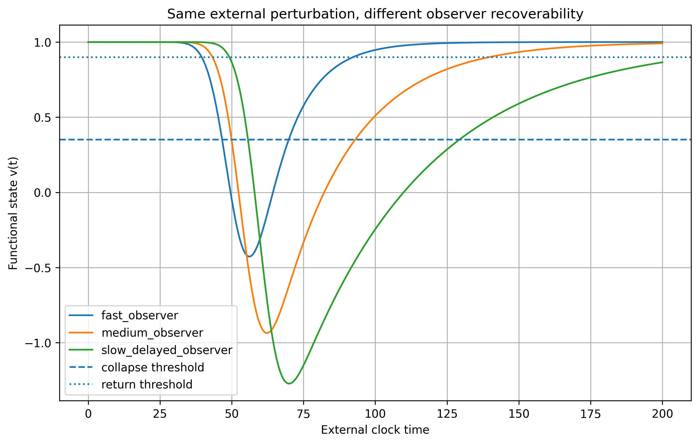

# Progressive Future Accessibility Loss

[](https://creativecommons.org/licenses/by/4.0/)
[](https://doi.org/10.5281/zenodo.20130285)

Minimal computational framework exploring how recoverability-constrained dynamical systems may progressively lose operational access to future regions despite remaining dynamically active under shared external temporal progression.
---



**Figure.** Systems subjected to identical external perturbation schedules exhibit progressively divergent recovery behavior under heterogeneous recoverability dynamics. Slower-recovery systems remain dynamically active while progressively losing operational future accessibility despite identical external forcing conditions.
## Overview

This repository contains the computational framework, simulations, figures, and manuscript associated with the study:

Recoverability-Limited Future Accessibility

The framework investigates whether heterogeneous recoverability constraints alone may generate:

- progressive future accessibility loss,
- operational temporal divergence,
- operational temporal freezing,
- fragmented future accessibility structure,
- stochastic accessibility fragmentation,
- and percolation-like degradation of global accessibility coherence.

Importantly, the framework does not propose modifications of physical spacetime structure or relativistic dynamics.

Instead, the results suggest that constrained recoverability alone may progressively alter operational future accessibility despite identical external forcing conditions and externally elapsed time.

## Core Concept

The central phenomenon explored in this work is:

> systems may remain dynamically active while progressively losing operational access to portions of their future accessibility landscape.

Within this interpretation, future accessibility becomes an evolving property of the system’s recoverability structure rather than a static consequence of externally elapsed time alone.

## Repository Structure

```text
paper/       → manuscript PDF
notebooks/   → simulation notebooks
figures/     → generated figures
outputs/     → simulation outputs
data/        → processed datasets
```

## Main Dynamical Model

The operational state variable evolves according to:

```text
dv/dt = (1 - v)/τ_r - E₀ u(t - Δ)
```

where:

- τ_r controls recovery timescale,
- Δ represents optional recovery delay,
- and u(t) denotes external perturbation forcing.

External perturbations are modeled as Gaussian forcing pulses.

## Topics

- recoverability
- dynamical accessibility
- resilience
- rate-induced transitions
- stochastic fragmentation
- accessibility geometry
- operational temporal evolution
- ERC frameworks

## Author

Jaime Ojeda

AI-assisted modeling and analysis using ChatGPT and Grok.

## License

Creative Commons Attribution 4.0 International (CC BY 4.0)
